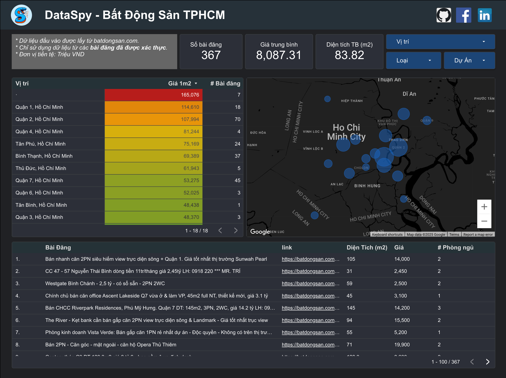
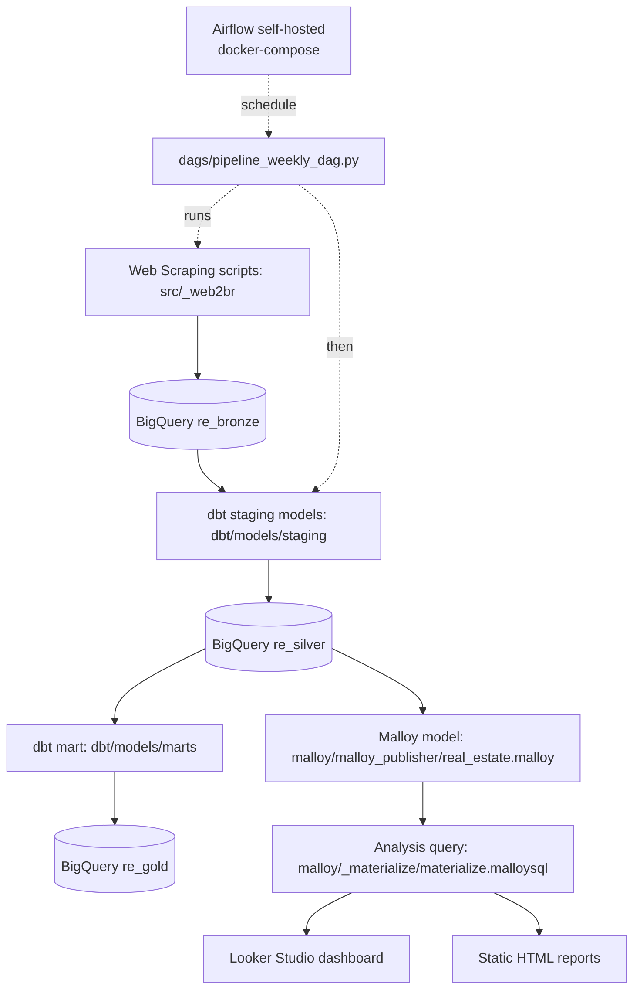

# Dữ liệu bất động sản

Dự án thu thập dữ liệu, chuẩn hóa dữ liệu để thực hiện phân tích về thị trường bất động sản tại Việt Nam với nguồn dữ liệu từ [batdongsan.com.vn](https://batdongsan.com.vn)

🔗 Trang giới thiệu dự án: **[dataspi.github.io/scrape-batdongsan-data](https://dataspi.github.io/scrape-batdongsan-data/)**

### Reports 
*(Updated: 2026-05-20)*
- [Báo cáo giá bất động sản theo quận (cũ) tại HN & TPHCM](docs/reports/HCM-HN_districts.html)
- [Báo cáo giá bất động sản theo dự án tại HN & TPHCM](docs/reports/HCM-HN_prj.html)
- Bài viết: [Đi xem nhà cùng Data Analyst - P1](https://spyno.substack.com/p/i-xem-nha-cung-data-analyst-p1)
  - Tháng 9-2025

### Dashboard 
*(Updated: 2026-02-16)*
- Dashboard: [Google Looker Studio](https://lookerstudio.google.com/reporting/9e21618f-97dc-4480-b101-cbda26b9b2a5)

### Quy trình xử lý dữ liệu

Pipeline chạy qua Docker + Airflow tự host (thay crontab), vì batdongsan.com.vn chặn IP của
cloud/CI runner — bước scrape bắt buộc chạy từ máy cá nhân. GitHub Actions lo lint/dbt
compile/build Docker image; không chạy scrape thật. Chi tiết: [technical-guides.md](docs/technical-guides.md).

## Quickstart

- Quickstart: [docs/quickstart.md](docs/quickstart.md)
- Hướng dẫn kỹ thuật: [docs/technical-guides.md](docs/technical-guides.md)
