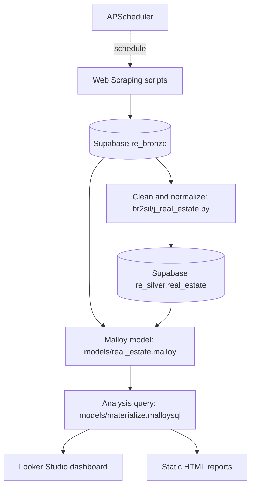

Dự án thu thập dữ liệu, chuẩn hóa dữ liệu để thực hiện phân tích về thị trường bất động sản tại Việt Nam với nguồn dữ liệu từ [batdongsan.com.vn](https://batdongsan.com.vn)

### Reports 
*(Updated: 2026-05-20)*
- [Báo cáo giá bất động sản theo quận (cũ) tại HN & TPHCM](reports/output/HCM-HN_districts.html)
- [Báo cáo giá bất động sản theo dự án tại HN & TPHCM](reports/output/HCM-HN_prj.html)
- Bài viết: [Đi xem nhà cùng Data Analyst - P1](https://spyno.substack.com/p/i-xem-nha-cung-data-analyst-p1)
  - Tháng 9-2025

### Dashboard 
*(Updated: 2026-02-16)*
- Dashboard: [Google Looker Studio](https://lookerstudio.google.com/reporting/9e21618f-97dc-4480-b101-cbda26b9b2a5)

### Quy trình xử lý dữ liệu

## Bắt đầu nhanh

- Quickstart: [docs/quickstart.md](docs/quickstart.md)
- Hướng dẫn kỹ thuật: [docs/technical-guides.md](docs/technical-guides.md)

