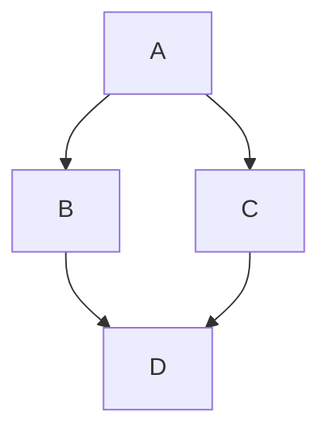

Dự án thu thập dữ liệu, chuẩn hóa dữ liệu để thực hiện phân tích về thị trường bất động sản tại Việt Nam với nguồn dữ liệu từ [batdongsan.com.vn](https://batdongsan.com.vn)

### Quy trình xử lý dữ liệu


### Dashboard minh họa


### Báo cáo mẫu: 
- [Báo cáo giá bất động sản theo dự án tại HN & TPHCM](reports/output/HCM-HN_prj.html)
- [Báo cáo giá bất động sản theo quận (cũ) tại HN & TPHCM](reports/output/HCM-HN_districts.html)


## Bắt đầu nhanh

- Quickstart: [docs/quickstart.md](docs/quickstart.md)
- Hướng dẫn kỹ thuật: [docs/technical-guides.md](docs/technical-guides.md)





```mermaid
subgraph B[Lớp Web Scraping]
  B1[j_real_estate.py<br/>Crawler listings + merge tracking JSON]
  B2[j_projects.py<br/>Crawler dự án]
  B3[j_metadata.py<br/>API metadata thành phố, phường, đường, dự án]
end

B --> C[(Supabase PostgreSQL<br/>re_bronze)]

C --> D[br2sil/j_real_estate.py<br/>Làm sạch + chuẩn hoá]
D --> E[(Supabase PostgreSQL<br/>re_silver.real_estate)]

E --> F[Malloy Semantic Model<br/>models/real_estate.malloy]
C --> F

C --> G[dbt Mart Model<br/>dbt/models/marts/fct_real_estate.sql]
E --> G

F --> H[Truy vấn phân tích<br/>models/materialize.malloysql]
G --> H

H --> I[Looker Studio Dashboard]

J[APScheduler local jobs] -. lên lịch .-> B
K[Airflow DAG scaffold] -. điều phối .-> B
K -. điều phối .-> D
```

