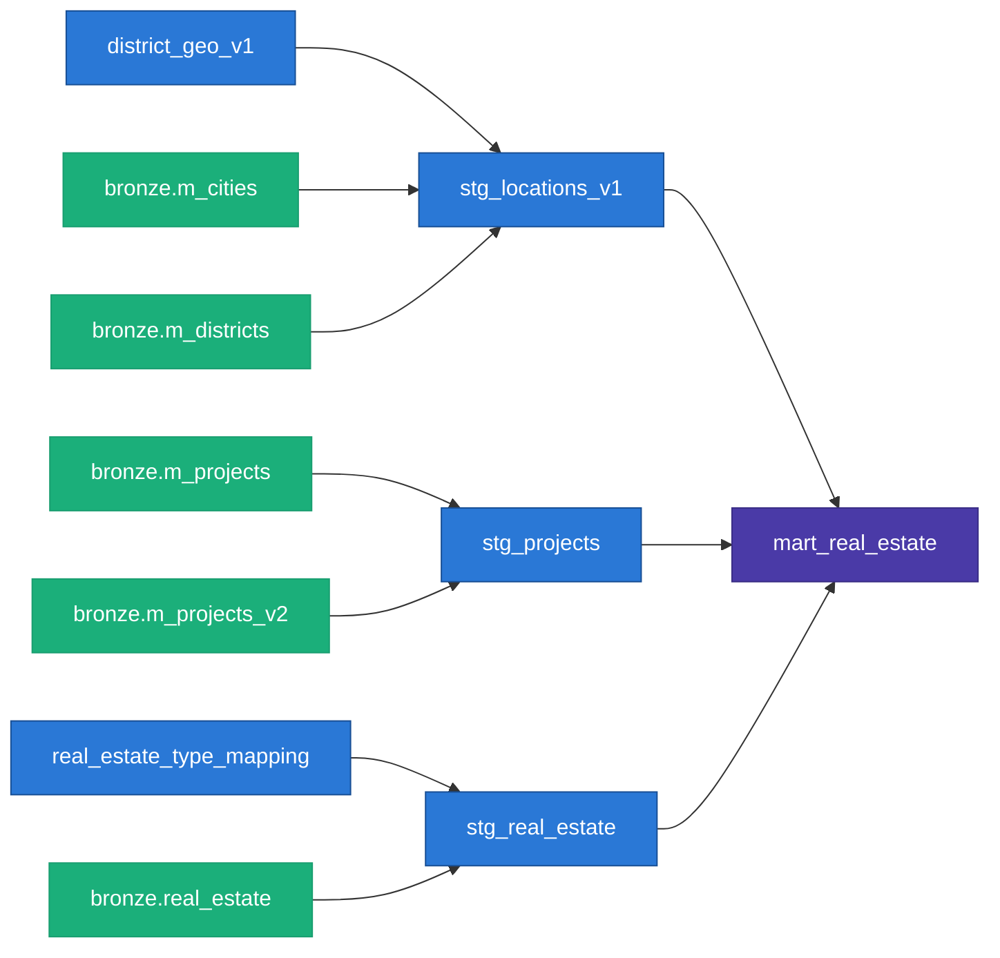

*(Draft — viết theo văn phong Spyno nhánh personal, Register B / Mẫu C: review-nhật ký thân mật. Bản đối chứng với bản writer_serious cùng chủ đề — giữ cả hai để chọn giọng.)*

# Note kỹ thuật: cái đêm bot của mình bắt đầu nói dối

Tldr:
- Kể lại vụ debug khá nhớ đời: sau đợt sáp nhập tỉnh thành 2025, con bot scrape của mình tự nhiên trả về data sai mà không báo lỗi gì cả.
- Giải thích nhanh cách mình fix + cách mình thiết kế lại data pipeline (BigQuery + dbt) cho gọn hơn thế hệ trước.
- Có kèm sơ đồ + vài đoạn code cho ai tò mò, không bắt buộc đọc hết nếu không quan tâm kỹ thuật.

---

Vào việc.

Lúc Việt Nam sáp nhập tỉnh thành đầu 2025, mình không nghĩ nó ảnh hưởng gì tới cái side-project scrape bất động sản của mình cả. Tưởng đó là chuyện giấy tờ hành chính, liên quan gì tới code của mình đâu.

Sai.

Đợt đó mình đang chạy pipeline đều đặn hàng tuần, tự nhiên một hôm ngồi soi lại data thấy cột quận/huyện của gần như *toàn bộ* tin đăng ở HCM chuyển hết thành số 0. Không phải lỗi crash, không phải log đỏ lòm gì cả — data vẫn chảy về bình thường, chỉ là nó đang nói dối mình một cách rất lịch sự =)))

Ngồi debug tới khuya hôm đó mới ra: `batdongsan.com.vn` có 2 kiểu url để lấy list tin — url theo *thành phố* và url theo *quận*. Trước sáp nhập cả hai đều trả đúng quận theo địa giới cũ. Sau sáp nhập, chỉ riêng HCM, url theo thành phố tự động chuyển qua chế độ hiển thị địa chỉ mới, và mọi tin lấy qua đó đều bị gắn quận = 0 (kiểu giá trị "chưa xác định được"). Còn Hà Nội thì không bị, không hiểu sao bên đó vẫn chạy bình thường.

Cùng 1 website, cùng 1 kiểu url, nhưng 2 thành phố trả lời khác nhau — và chả có gì báo cho mình biết cả, tự mình phải soi ra.

**Cách mình fix:** đừng hỏi tổng đài thành phố nữa, hỏi thẳng từng quận luôn. Viết lại crawler, với HCM thì lặp qua từng quận trong danh mục cũ, tự build url riêng cho từng quận rồi crawl lần lượt — kiểu này buộc site phải trả đúng quận theo địa giới cũ. Hà Nội thì giữ nguyên, crawl 1 url thành phố như cũ, không việc gì phải đổi cái đang chạy tốt.

Xong phần crawl chưa hết đâu — còn vụ dữ liệu tham chiếu (bảng quận/thành phố) nữa. Lúc đó mình đứng trước 2 lựa chọn: cập nhật hết theo địa giới mới (thì báo cáo cũ so sánh trước-sau sẽ lệch, vì "Quận 2" cũ với phường mới không map 1-1), hoặc giữ nguyên bảng cũ (thì mất đi việc theo kịp địa giới thật). Mình chọn... cả hai luôn — giữ song song 2 bảng, dán nhãn rõ ràng: một bảng "cũ, đóng băng, không refresh nữa", một bảng "mới, đang refresh liên tục". Báo cáo hiện tại vẫn nối vào bảng cũ để nhất quán với bài viết trước, còn bảng mới nằm sẵn đó, để dành lúc cần.

## Sơ đồ cho ai tò mò

Pipeline giờ chạy dạng: batdongsan.com.vn → BigQuery (3 lớp: bronze thô → silver đã lọc dedup → gold sẵn sàng báo cáo) → dbt build hết lớp silver/gold → đổ ra Looker Studio + mấy trang html tĩnh publish qua GitHub Pages.



*(Render thử ở mermaid.live trước khi đăng nha, mình chưa export ảnh. Lưu ý chưa vẽ 2 model địa giới mới vì chúng nó chưa nối vào bảng báo cáo cuối, còn để dành.)*

## Vài thứ mình khá tự hào

- **Né chặn bot bằng cách giả đúng chữ ký TLS của Chrome thật** (`curl_cffi`, `impersonate="chrome124"`), không chỉ đổi User-Agent cho có. Đỡ bị chặn hơn nhiều.
- **Ghi data kiểu chỉ thêm vào, không bao giờ ghi đè** (`WRITE_APPEND`) — mọi lần scrape đều lưu lại nguyên vẹn, việc "giữ bản nào là bản đúng nhất" để dành cho bước xử lý sau, không quyết ngay lúc ghi. Kiểu sổ nhật ký không tẩy xóa, chỉ có bước sau khoanh tròn dòng mới nhất khi cần.
- **Có test tự động cho đúng luật nghiệp vụ**, không chỉ test kiểu "không được null" cho có: một test tự fail nếu site xuất hiện loại bất động sản lạ chưa map, một test khác fail nếu giá/diện tích bị parse ra số âm. Với project một mình, không ai review code cho mình, mấy cái test này thay cho đồng đội canh lỗi.
- **Cảnh báo nếu pipeline âm thầm chết** — set freshness check, quá 10 ngày không có data mới thì cảnh báo, quá 3 tuần thì coi như lỗi thật. Chạy 1 mình trên máy cá nhân, sợ nhất là lỗi im lặng chứ không phải lỗi ồn ào.

Thiệt ra ngồi viết lại mấy cái này ra mới nhận ra là hồi làm mình chỉ nghĩ "làm sao cho chạy đã", giờ nhìn lại mới thấy nó vô tình đúng mấy cái nguyên tắc data engineering "chuẩn" luôn — versioning rõ ràng, tách trách nhiệm từng lớp, test luật nghiệp vụ. Không phải mình giỏi từ đầu, mà là bị vấn đề thật dí vào tường buộc phải nghĩ ra cách, rồi nhìn lại mới thấy nó có tên gọi đàng hoàng =)))

## Còn thiếu gì

Url crawl chính hiện giờ chỉ nhắm đúng 1 danh mục — chung cư. Buồn cười là phần phân loại ở lớp transform đã handle sẵn tới 6 loại hình rồi (biệt thự, nhà riêng, nhà mặt phố, shophouse, condotel...), chỉ là chưa có ai đi hỏi mấy loại đó thôi. Việc tiếp theo của mình là mở rộng crawl sang nhà đất, chắc để dịp khác vì mạng nhà mình dạo này hơi phập phù =)))

Túm lại: vụ sáp nhập tỉnh thành là một bài học nhớ đời về việc data "tưởng tĩnh" (như danh mục quận huyện) hoá ra cũng không tĩnh tí nào. Ai làm data lâu chắc cũng từng dính vụ tương tự, comment kể mình nghe với, tò mò lắm.

---

## Note kỹ thuật thêm (để tra cứu)

- Data contract khoá kiểu dữ liệu (`contract: enforced: true`) trên bảng gold — sai kiểu là fail ngay, không để lỗi trôi xuống báo cáo.
- Dedup bằng window function, không phải xoá tay:
  ```sql
  row_number() over (
      partition by unique_id
      order by scraped_at desc nulls last
  ) as rn
  ...
  where rn = 1
  ```
- Fallback địa giới khi tin lẻ không tự có quận hợp lệ — lấy quận của dự án nó thuộc về:
  ```sql
  coalesce(nullif(re.districtId, 0), project.districtId) as full_districtId
  ```
- Pipeline chạy trên máy cá nhân qua crontab, không phải cloud — vì site chặn IP cloud runner, đây là trade-off có chủ đích chứ không phải lười deploy.

### References

- Code: `src/_web2br/j_real_estate.py`, `dbt/models/staging/`, `dbt/models/marts/_marts.yml`, `dbt/tests/`.
