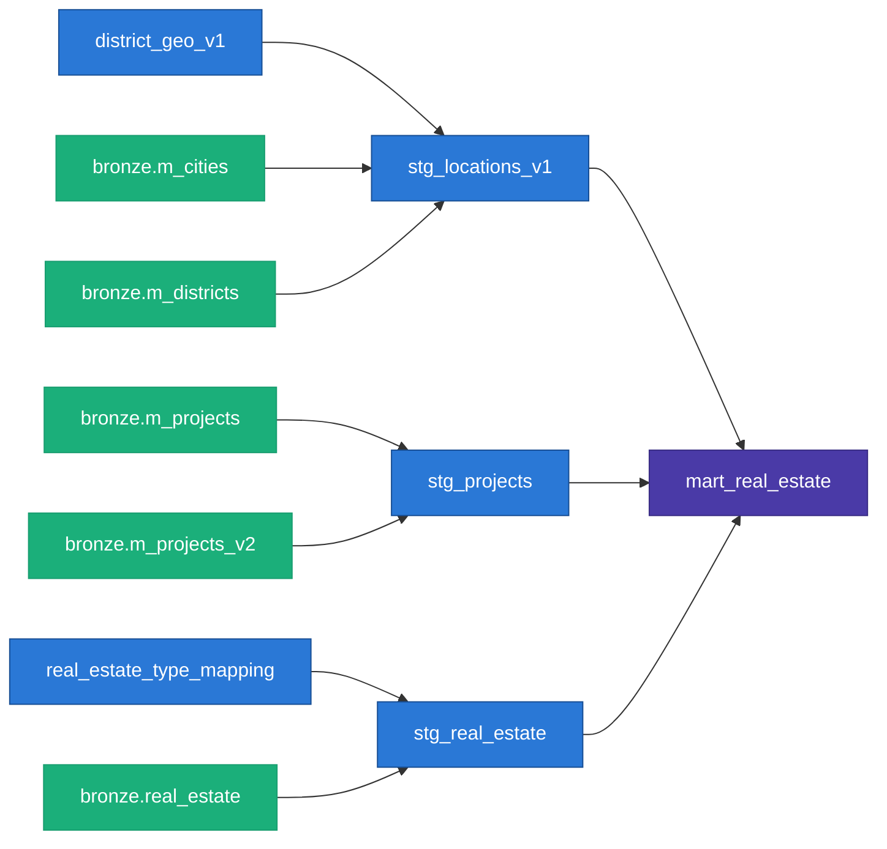

*(Draft — viết theo văn phong Spyno nhánh personal, Register B / Mẫu C, nhưng bản này ưu tiên phân tích kỹ thuật hơn kể chuyện. Bản đối chứng với bản writer_serious cùng chủ đề — giữ cả hai để chọn giọng.)*

# Sáp nhập tỉnh thành phá crawler như thế nào — và cách mình vá

Tldr:
- Đầu 2025 VN sáp nhập tỉnh thành, `batdongsan.com.vn` đổi cách trả địa giới hành chính cho URL cấp thành phố ở HCM (không đổi ở Hà Nội) — data vẫn chảy về bình thường nhưng cột quận/huyện toàn số 0.
- Fix ở 2 tầng: đổi chiến lược crawl (crawl theo quận thay vì theo thành phố cho HCM), và versioning dữ liệu tham chiếu (giữ song song bảng địa giới cũ/mới thay vì ghi đè).
- Bài này liệt kê cụ thể tool + kỹ thuật đang dùng trong pipeline (BigQuery + dbt), kèm code, không kể lể nhiều.

---

## Vấn đề: cùng 1 site, 2 thành phố trả lời khác nhau

`batdongsan.com.vn` có 2 dạng URL để lấy list tin: URL cấp *thành phố* và URL cấp *quận*. Trước sáp nhập, cả hai đều resolve đúng quận theo địa giới cũ. Sau sáp nhập:

- **HCM**: URL cấp thành phố tự động chuyển qua chế độ hiển thị địa chỉ mới, mọi tin lấy qua đó bị gắn `districtId = 0` (sentinel "chưa xác định").
- **Hà Nội**: không bị ảnh hưởng, URL cấp thành phố vẫn resolve đúng như cũ.

Không có exception, không có log lỗi — response vẫn 200, JSON vẫn đúng schema, chỉ là field sai. Loại lỗi này không bắt được bằng try/except hay status code check, chỉ bắt được bằng test ở tầng data (nói ở phần dưới).

## Giải pháp 1: đổi đơn vị crawl thay vì đổi parser

Thay vì cố sửa cách parse response của URL thành phố (không sửa được, vì site chủ động đổi hành vi phía server), mình đổi hẳn đơn vị crawl cho HCM: từ 1 URL cấp thành phố → N URL cấp quận, lặp qua từng quận trong danh mục cũ, tự build slug riêng rồi crawl tuần tự. Crawl ở cấp quận buộc site phải trả lời theo địa giới cũ.

Hà Nội giữ nguyên crawl 1 URL thành phố — không đổi phần đang chạy đúng.

Đây là quyết định kỹ thuật cụ thể, không phải fix chung chung: **route theo thành phố, không route theo 1 logic thống nhất cho cả nước**, vì hành vi thực tế của site khác nhau theo thành phố sau sự kiện hành chính. Code không có tài liệu nào của site nói trước điều này — phải suy ra từ việc so sánh output.

## Giải pháp 2: versioning dữ liệu tham chiếu thay vì ghi đè

Bảng quận/thành phố là dữ liệu tham chiếu (reference data), và sau sáp nhập nó có 2 phiên bản đúng cùng lúc: địa giới cũ (báo cáo trước đó đang dùng) và địa giới mới (site hiện tại đang dùng). Ghi đè bảng cũ bằng bảng mới sẽ làm lệch mọi so sánh trước-sau, vì "Quận 2" cũ không map 1-1 sang phường mới.

Cách xử lý: giữ song song 2 model dbt, dán nhãn rõ vai trò từng bảng — không coi bảng nào là "phế phẩm" cần dọn:

- `stg_locations_v1` — hierarchy cũ, join từ `m_cities`/`m_districts`. Đóng băng có chủ đích, không refresh nữa.
- `stg_locations_v2` — hierarchy mới theo phường/xã, join từ `m_wards_v2`/`m_cities_v2`, refresh liên tục.

`mart_real_estate` hiện chỉ join vào v1 để nhất quán với báo cáo cũ. Cột theo v2 đã có sẵn trong schema nhưng chưa bật — chừa sẵn đường nối, không phải bỏ dở.

Ngay cả sau khi crawl đúng cấp quận, field địa giới trên tin lẻ vẫn không đáng tin 100% (có tin thiếu, có tin vẫn dính sentinel 0). Thêm 1 lớp fallback: tin không có quận hợp lệ thì lấy quận của dự án nó thuộc về (tỷ lệ khớp quận ở tầng dự án cao hơn hẳn):

```sql
coalesce(nullif(re.districtId, 0), project.districtId) as full_districtId
```

## Kiến trúc pipeline

BigQuery 3 lớp (bronze thô → silver lọc/dedup → gold sẵn sàng báo cáo) + dbt build silver/gold → Looker Studio + html tĩnh publish qua GitHub Pages.



*(Render thử ở mermaid.live trước khi đăng. Chưa vẽ 2 model địa giới mới vì chúng chưa nối vào bảng báo cáo cuối.)*

## Tool và kỹ thuật đang dùng, theo từng tầng

**Crawl (bronze):**
- `curl_cffi` với `impersonate="chrome124"` — giả đúng chữ ký TLS handshake của Chrome thật, không chỉ đổi header User-Agent. Vượt qua được lớp chặn bot dựa trên network fingerprint, không chỉ header-based filtering.
- Ghi kiểu `WRITE_APPEND`, không bao giờ ghi đè — mỗi lần crawl là một bản ghi độc lập, giữ nguyên vẹn. Quyết định "bản nào là bản đúng nhất" đẩy hết xuống tầng transform, không quyết ở tầng ghi. Lợi ích trực tiếp: replay/rebuild lại toàn bộ từ đầu bất cứ lúc nào mà không mất dữ liệu gốc.

**Transform (silver/gold, dbt):**
- Dedup bằng window function ở tầng transform, tách khỏi logic crawl:
  ```sql
  row_number() over (
      partition by unique_id
      order by scraped_at desc nulls last
  ) as rn
  ...
  where rn = 1
  ```
- Data contract khoá kiểu dữ liệu (`contract: enforced: true`) trên bảng gold — sai kiểu là `dbt run` fail ngay tại chỗ build, không để lỗi trôi xuống dashboard rồi người đọc report mới phát hiện.
- Test theo luật nghiệp vụ cụ thể, không chỉ generic `not_null`/`unique`: 1 test fail nếu site xuất hiện loại bất động sản chưa có trong bảng mapping (tín hiệu sớm khi site đổi taxonomy), 1 test khác fail nếu giá/diện tích parse ra số âm. Ý nghĩa thực tế với project 1 người không ai review code: mấy test này đóng vai trò reviewer thay đồng đội.
- Freshness check: quá 10 ngày không có data mới → cảnh báo, quá 3 tuần → coi là lỗi thật. Cần thiết vì pipeline chạy độc lập trên máy cá nhân, không ai theo dõi liên tục — rủi ro lớn nhất không phải lỗi ồn ào mà là cron chết âm thầm.

**Vận hành:**
- Chạy qua crontab trên máy cá nhân, không phải cloud. Trade-off có chủ đích: site chặn IP của các cloud runner phổ biến, cần IP "người thật" để crawl ổn định.

## Còn thiếu

URL crawl chính hiện chỉ nhắm 1 danh mục (chung cư), trong khi tầng phân loại ở transform đã handle sẵn 6 loại hình (biệt thự, nhà riêng, nhà mặt phố, shophouse, condotel...) qua bảng mapping có sẵn — phần transform đi trước phần crawl. Việc tiếp theo: mở rộng crawl sang nhà đất để tận dụng phần transform đã sẵn sàng.

---

### References

- Code: `src/_web2br/j_real_estate.py`, `dbt/models/staging/`, `dbt/models/marts/_marts.yml`, `dbt/tests/`.
