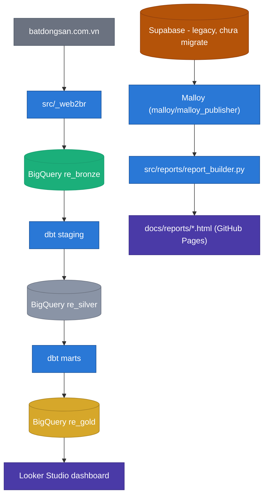
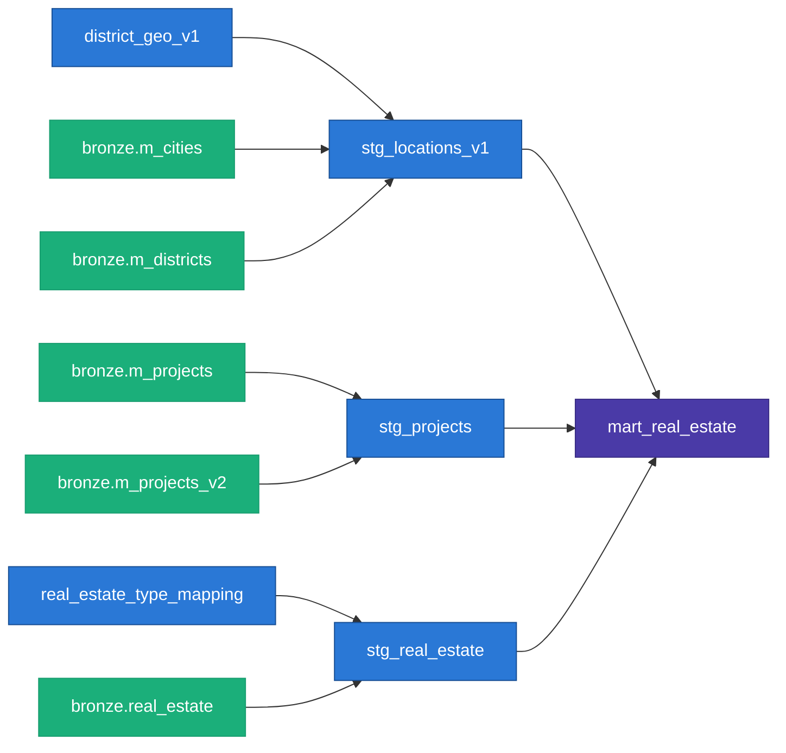

# Kiến trúc pipeline bất động sản của mình, và một lần nó bị sáp nhập tỉnh thành phá vỡ

Tldr:
- Phần 1: tổng quan tech stack + data flow của side-project scrape `batdongsan.com.vn` — 1 người vận hành, chạy trên máy cá nhân.
- Phần 2: vấn đề thực tế đầu 2025 khi VN sáp nhập tỉnh thành — site trả sai địa giới hành chính mà không báo lỗi — và cách xử lý ở 2 tầng: crawl và data modeling.

---

## 1. Tổng quan dự án

### Tech stack

| Tầng | Tool | Vai trò |
|---|---|---|
| Scrape | Python + `curl_cffi` | Lấy data thô từ `batdongsan.com.vn`, giả chữ ký TLS Chrome thật để né chặn bot |
| Lưu trữ | BigQuery, 3 schema | `re_bronze` (raw) → `re_silver` (staging, deduped) → `re_gold` (mart, sẵn sàng báo cáo) |
| Transform | dbt | Model staging/marts, test, data contract |
| BI | Looker Studio | Dashboard tương tác, đọc trực tiếp từ `re_gold` qua BigQuery connector — không qua Malloy |
| Báo cáo tĩnh | `src/reports/report_builder.py` + Malloy | Malloy chạy query, `report_builder.py` render kết quả ra HTML, publish qua GitHub Pages *(Malloy hiện vẫn trỏ Supabase cũ, chưa migrate theo BigQuery — nợ kỹ thuật đang treo)* |
| Orchestration | `src/orchestrator/run_pipeline.py` + crontab | Chạy tuần tự, dừng ngay khi có bước lỗi |
| Hosting | Máy cá nhân, không phải cloud | `batdongsan.com.vn` chặn IP của cloud runner phổ biến — cần IP "người thật" |

### Data flow



Chi tiết DAG ở tầng dbt (staging → mart):



*(Render thử ở mermaid.live trước khi đăng. Chưa vẽ `stg_locations_v2` vì model đó chưa nối vào `mart_real_estate` — nói kỹ ở phần 2.)*

### Setup dbt

- **Schema per layer**: `dbt_project.yml` map thẳng từng thư mục model vào 1 schema BigQuery (`staging` → `re_silver`, `marts` → `re_gold`), staging materialize dạng table thay vì view để đỡ tốn compute cho downstream.
- **Data contract** ở tầng mart (`_marts.yml`, `contract: enforced: true`) — khoá kiểu dữ liệu từng cột, sai kiểu là `dbt run` fail ngay tại chỗ build.
- **Freshness check** ở tầng source (`_sources.yml`) — cảnh báo/fail nếu quá lâu không có data mới, bắt lỗi pipeline chết âm thầm.

### Kỹ thuật đáng chú ý ở từng tầng

- **Anti-bot ở tầng scrape**: `curl_cffi` với `impersonate="chrome124"` — giả đúng chữ ký bắt tay TLS của Chrome thật, không chỉ đổi header User-Agent. Vượt qua lớp chặn dựa trên network fingerprint.
- **Append-only ở bronze**: ghi kiểu `WRITE_APPEND`, không bao giờ ghi đè. Quyết định "bản nào là bản đúng nhất" đẩy xuống tầng transform, không quyết ở tầng ghi — cho phép replay/rebuild lại toàn bộ từ đầu bất cứ lúc nào.
- **Dedup ở silver bằng window function**, tách khỏi logic crawl:
  ```sql
  row_number() over (
      partition by unique_id
      order by scraped_at desc nulls last
  ) as rn
  ...
  where rn = 1
  ```
- **Test theo luật nghiệp vụ**, không chỉ generic `not_null`/`unique`: `assert_known_real_estate_type` fail nếu site xuất hiện loại BĐS chưa map trong seed; `assert_no_negative_price_or_area` fail nếu giá/diện tích parse ra số âm.

## 2. Vấn đề: sáp nhập tỉnh thành phá vỡ tầng địa giới hành chính

Đầu 2025 VN sáp nhập tỉnh thành. Ảnh hưởng trực tiếp tới pipeline: cột quận/huyện của gần như *toàn bộ* tin đăng ở HCM chuyển thành số 0 — không có exception, không có log lỗi, response vẫn 200, JSON vẫn đúng schema, chỉ sai field.

### Nguyên nhân

`batdongsan.com.vn` có 2 dạng URL để lấy list tin: URL cấp *thành phố* và URL cấp *quận*. Trước sáp nhập, cả hai đều resolve đúng quận theo địa giới cũ. Sau sáp nhập:

- **HCM**: URL cấp thành phố tự động chuyển qua chế độ hiển thị địa chỉ mới, mọi tin lấy qua đó bị gắn `districtId = 0` (sentinel "chưa xác định").
- **Hà Nội**: không bị ảnh hưởng, URL cấp thành phố vẫn resolve đúng như cũ.

Cùng 1 site, cùng 1 dạng URL, 2 thành phố trả lời theo 2 chuẩn khác nhau — không có tài liệu nào của site báo trước, chỉ phát hiện được qua việc so sánh output.

### Giải pháp 1: đổi đơn vị crawl thay vì đổi parser

Không sửa được cách site resolve response (server-side, ngoài tầm kiểm soát), nên đổi hẳn đơn vị crawl cho HCM: từ 1 URL cấp thành phố → N URL cấp quận, lặp qua từng quận trong danh mục cũ, tự build slug riêng rồi crawl tuần tự. Crawl ở cấp quận buộc site phải trả lời theo địa giới cũ.

Hà Nội giữ nguyên crawl 1 URL thành phố — không đổi phần đang chạy đúng. Kết quả: **route theo thành phố**, không phải 1 logic thống nhất áp cho cả nước, vì hành vi thực tế của site khác nhau sau sự kiện hành chính.

### Giải pháp 2: versioning dữ liệu tham chiếu thay vì ghi đè

Bảng quận/thành phố là dữ liệu tham chiếu, và sau sáp nhập nó có 2 phiên bản đúng cùng lúc: địa giới cũ (báo cáo trước đó đang dùng) và địa giới mới (site hiện tại đang dùng). Ghi đè bảng cũ sẽ làm lệch mọi so sánh trước-sau, vì "Quận 2" cũ không map 1-1 sang phường mới.

Xử lý bằng 2 model dbt song song, dán nhãn rõ vai trò:

- `stg_locations_v1` — hierarchy cũ, join từ `m_cities`/`m_districts`. Đóng băng có chủ đích, không refresh nữa.
- `stg_locations_v2` — hierarchy mới theo phường/xã, join từ `m_wards_v2`/`m_cities_v2`, refresh liên tục.

`mart_real_estate` hiện chỉ join vào v1 để nhất quán với báo cáo cũ. Cột theo v2 đã có sẵn trong schema nhưng chưa bật.

Thêm 1 lớp fallback vì field địa giới trên tin lẻ vẫn không đáng tin 100% sau khi crawl đúng cấp quận (có tin thiếu, có tin vẫn dính sentinel 0): tin không có quận hợp lệ thì lấy quận của dự án nó thuộc về.

```sql
coalesce(nullif(re.districtId, 0), project.districtId) as full_districtId
```

## Còn thiếu

- URL crawl chính hiện chỉ nhắm 1 danh mục (chung cư), trong khi tầng phân loại ở transform đã handle sẵn 6 loại hình (biệt thự, nhà riêng, nhà mặt phố, shophouse, condotel...) — phần transform đi trước phần crawl. Việc tiếp theo: mở rộng crawl sang nhà đất.
- `stg_locations_v2` chưa nối vào `mart_real_estate`.
- Nhánh báo cáo tĩnh (Malloy → `report_builder.py`) vẫn đang trỏ Supabase cũ, chưa migrate theo BigQuery — tách biệt hoàn toàn với nhánh Looker Studio (đã đọc thẳng `re_gold`).

---

### References

- Code: `src/_web2br/j_real_estate.py`, `src/orchestrator/run_pipeline.py`, `dbt/models/staging/`, `dbt/models/marts/_marts.yml`, `dbt/tests/`.
- Doc vận hành đầy đủ: `docs/technical-guides.md`.
