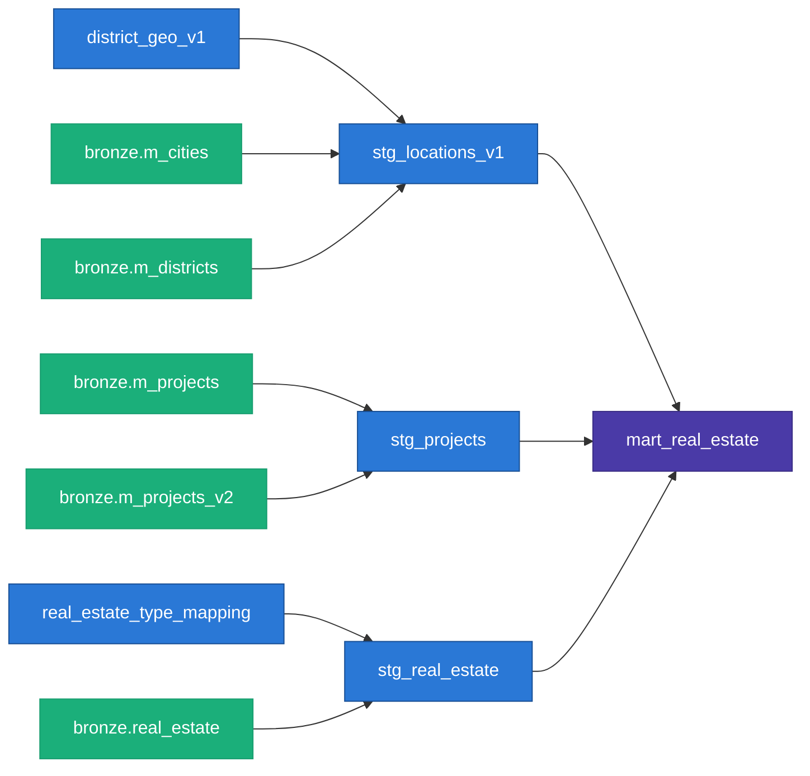

*(Draft — viết theo văn phong Spyno nhánh serious, sub-mode A: kể chuyện kỹ thuật dễ tiếp cận, ẩn dụ xuyên suốt là "nhà máy lọc nước". Cần mày đọc lại, chỉnh giọng, và tự quyết đoạn nào cắt.)*

# Một đêm, Việt Nam vẽ lại bản đồ — và con bot của tôi bắt đầu nói dối

Đầu năm 2025, Việt Nam sáp nhập tỉnh thành. Ranh giới hành chính của cả nước được vẽ lại — không phải qua nhiều năm, mà gần như trong một đợt. Bà Rịa–Vũng Tàu và Bình Dương nhập vào TP.HCM. Hàng loạt quận huyện đổi tên, đổi cấp, đổi mã.

Tôi không quan tâm chuyện này ảnh hưởng gì đến giấy tờ hành chính của ai. Tôi quan tâm vì con bot scrape dữ liệu bất động sản của tôi, chạy đều đặn mỗi tuần suốt cả năm trước đó, đột nhiên bắt đầu trả về những dòng dữ liệu mà quận/huyện của gần như *mọi* tin đăng ở TP.HCM đều là con số 0.

Không phải lỗi cú pháp. Không phải site sập. Dữ liệu vẫn chảy về đều, chỉ là nó đang nói dối tôi một cách rất lịch sự.

## Bối cảnh: một dây chuyền lọc nước, không phải một cái xô

Trước khi vào chuyện con số 0 đó, cần nói qua dự án này trông như thế nào, vì nếu không hình dung được cái máy đang chạy thì không thấy được vì sao lỗi kia đáng sợ.

Tôi hay ví pipeline dữ liệu của mình như một dây chuyền lọc nước ba tầng, chạy trên BigQuery:

- **`re_bronze`** — nước sông vừa bơm vào. Thô, còn nguyên rác, có thể trùng lặp nhiều lần vì mỗi lần bot chạy lại bơm thêm một mẻ mới, không gạn lọc gì cả (`WRITE_APPEND` — chỉ có thêm vào, không bao giờ ghi đè).
- **`re_silver`** — qua lớp màng lọc thô đầu tiên: gạn rác (parse giá/diện tích từ chuỗi text), loại bản trùng (mỗi tin chỉ giữ lần bơm gần nhất), đo lại các chỉ số cơ bản.
- **`re_gold`** — nước đã đóng chai, dán nhãn, đưa ra kệ. Đây là bảng duy nhất báo cáo/dashboard được phép động vào — có "cam kết chất lượng" đi kèm (tôi nói kỹ ở phần sau).

Dây chuyền này chạy một mình, hằng tuần, qua crontab trên máy cá nhân của tôi — không phải trên cloud. Đây là một quyết định có chủ đích, không phải vì tiết kiệm: `batdongsan.com.vn` chặn IP của mọi cloud runner phổ biến. Muốn scrape ổn định, phải chạy từ một địa chỉ IP "người thật" — tức là máy tôi. Nghe có vẻ thụt lùi so với "cloud-native", nhưng đây là kiểu trade-off mà bất kỳ ai từng scrape dữ liệu thật đều sẽ gặp: **chuẩn kỹ thuật đẹp phải nhường chỗ cho việc chạy được**, khi đối tượng bạn đang lấy dữ liệu chủ động không muốn bạn lấy.

Vậy — con số 0 kia chảy vào ở tầng nào của dây chuyền?

## Tầng bronze: nơi cái bot học cách "hỏi đúng cửa"

Con bot của tôi lấy dữ liệu bằng cách giả dạng một trình duyệt thật — không chỉ đổi User-Agent, mà dùng `curl_cffi` với `impersonate="chrome124"`, tức là giả đúng cả chữ ký bắt tay TLS của Chrome thật. Giống như thay vì mặc đồng phục giao hàng giả, bạn học đúng cách gõ cửa của một vị khách quen — vượt qua được nhiều lớp chặn bot dựa trên hành vi kết nối, không chỉ header.

Nhưng gõ đúng cửa không có nghĩa là hỏi đúng câu. Và đây là chỗ đợt sáp nhập tỉnh thành đâm thẳng vào giữa hệ thống.

`batdongsan.com.vn` có hai kiểu URL để lấy danh sách tin: URL cấp *thành phố* (`/ban-can-ho-chung-cu-tp-ho-chi-minh`) và URL cấp *quận* (`/ban-can-ho-chung-cu-quan-2`). Trước sáp nhập, cả hai đều trả về đúng quận/huyện theo địa giới cũ. Sau sáp nhập — chỉ với TP.HCM — trang cấp *thành phố* tự động chuyển sang chế độ `IsDisplayNewAddress=true`, và mọi tin đăng lấy qua URL đó đều trả về `districtId=0`, một giá trị sentinel nghĩa là "chưa resolve được", không phải một quận thật. Hà Nội thì không bị — trang cấp thành phố của Hà Nội vẫn resolve đúng theo địa giới cũ, không hiểu vì lý do vận hành nội bộ nào của site.

Cùng một loại URL. Cùng một website. Nhưng hai thành phố trả lời theo hai chuẩn khác nhau — và không có gì trong response báo cho bạn biết điều đó đang xảy ra, ngoài việc một cột dữ liệu bỗng toàn số 0.

**Giải pháp:** đừng hỏi tổng đài thành phố — hỏi thẳng từng phường. Tôi viết lại crawler để với TP.HCM, thay vì gọi một URL cấp thành phố, nó lặp qua *từng quận* lấy từ danh mục cũ, tự build URL riêng cho từng quận (`slugify_district`), rồi crawl lần lượt. Crawl ở cấp quận buộc site trả lời đúng theo địa giới cũ — kể cả với nhà đất không gắn dự án, chứ không chỉ những tin có sẵn `projectId` để suy ra được quận qua đường vòng. Hà Nội không cần trick này — vẫn crawl một URL cấp thành phố như cũ.

Nói cách khác: **hai thành phố, hai chiến lược crawl khác nhau, vì cùng một website nhưng cư xử khác nhau sau một sự kiện hành chính mà chính website đó cũng không chủ động thông báo.** Đây không phải kiểu bug có trong tài liệu hay Stack Overflow — nó đòi hỏi vừa hiểu domain (địa giới hành chính Việt Nam vừa đổi ra sao), vừa dò ra hành vi lạ của một hệ thống bên thứ ba không có tài liệu công khai.

## Tầng silver: giữ lại cả bản đồ cũ, đừng vẽ đè lên

Xử lý xong ở tầng crawl mới chỉ là một nửa. Nửa còn lại: **cả nước đang có hai bộ bản đồ hành chính** — cũ và mới — và dữ liệu tham chiếu (quận nào thuộc thành phố nào, toạ độ ở đâu) cũng phải tồn tại ở cả hai dạng, vì báo cáo cũ (bài P1 trước đó) đã lỡ dùng địa giới cũ, còn dữ liệu mới nhất trên site lại đang dùng địa giới mới.

Cách tôi xử lý: **không vẽ đè lên bản đồ cũ — giữ nguyên nó, dán nhãn rõ ràng, rồi vẽ thêm một bản đồ mới bên cạnh.**

Cụ thể là hai model dbt song song:

- `stg_locations_v1` — hierarchy **cũ**, join từ `m_cities`/`m_districts`. Trong tài liệu nguồn (`_sources.yml`) tôi ghi rõ: *"Legacy (v1/old address scheme)... Frozen — no longer refreshed"* — đóng băng có chủ đích, không phải bỏ quên.
- `stg_locations_v2` — hierarchy **mới** theo phường/xã sau sáp nhập, join từ `m_wards_v2`/`m_cities_v2`, được refresh liên tục.

Bảng báo cáo cuối cùng (`mart_real_estate`) hiện tại **chỉ join vào v1** — giữ tính nhất quán với báo cáo cũ, để một con số "Quận 2" hôm nay vẫn cùng nghĩa với "Quận 2" mười tháng trước. Các cột theo địa giới mới (`ward_name_v2`, `city_name_v2`...) đã có sẵn trong schema nhưng đang comment lại, chưa bật — một việc dở dang có chủ đích, để dành cho lúc cần báo cáo theo địa giới mới.

Và vì ngay cả sau khi crawl đúng cấp quận, field địa giới trên từng tin lẻ vẫn không đáng tin 100% — có tin không có, có tin vẫn dính sentinel 0 — tôi thêm một lớp fallback: nếu tin không tự có quận hợp lệ, lấy quận của *dự án* mà nó thuộc về (dự án có tỷ lệ khớp quận cao hơn hẳn, khoảng 95% với chung cư):

```sql
coalesce(nullif(re.districtId, 0), project.districtId) as full_districtId
```

Một dòng SQL, nhưng đứng sau nó là cả câu chuyện "hỏi tổng đài thì sai, hỏi từng phường thì đúng, còn nếu vẫn không ai trả lời thì hỏi hàng xóm của nó (dự án) xem nó thuộc phường nào".

## Tầng gold: nước đóng chai phải có cam kết chất lượng

Tầng cuối cùng của dây chuyền lọc là nơi tôi khắt khe nhất, vì đây là bảng duy nhất người khác (báo cáo, dashboard, và giờ là chính mày đang đọc con số trong bài trước) được phép động vào.

Ba lớp phòng thủ tôi đặt ở đây:

- **Data contract khoá cứng kiểu dữ liệu từng cột** (`contract: enforced: true` trong dbt) — nếu SQL đổi mà trả về sai kiểu hoặc thiếu cột, `dbt run` chết ngay tại chỗ, thay vì âm thầm đẩy lỗi xuống tận dashboard rồi để người đọc báo cáo phát hiện ra số liệu sai.
- **Test theo đúng luật nghiệp vụ**, không chỉ `not_null`/`unique` cho có: một test tên `assert_known_real_estate_type` sẽ fail nếu xuất hiện loại bất động sản không khớp danh mục đã biết — tín hiệu sớm khi site tự đổi cách đặt tên loại hình mà tôi chưa kịp map; một test khác fail nếu giá hoặc diện tích bị parse ra số âm.
- **Cảnh báo khi nước ngừng chảy**: một `freshness` check trên bảng nguồn — nếu quá 10 ngày không có dữ liệu mới thì cảnh báo, quá 21 ngày thì coi là lỗi thật sự. Vì một pipeline chạy một mình trên máy cá nhân, không ai theo dõi 24/7, thì thứ nguy hiểm nhất không phải là lỗi ồn ào — mà là lỗi im lặng, cron chết mà không ai biết trong ba tuần.

Việc dedup — quyết định giữ bản ghi nào khi một tin bị scrape trùng nhiều lần — cũng nằm ở tầng này, không phải ở tầng crawl:

```sql
row_number() over (
    partition by unique_id
    order by scraped_at desc nulls last
) as rn
...
where rn = 1
```

Cố tình tách trách nhiệm: tầng bronze chỉ có một việc — ghi lại đúng những gì lấy được, không tự ý phán đoán bản nào "đúng hơn". Việc "đúng hơn" là business logic, và business logic thì nên nằm ở một chỗ dễ đọc, dễ sửa, dễ test — không phải rải rác trong logic scrape.

## Toàn cảnh DAG



*(render bằng mermaid.live hoặc VSCode trước khi đưa vào bài. Chưa vẽ `stg_locations_v2`/`ward_geo_v2` vì hai model đó chưa nối vào `mart_real_estate` — đúng phần "dở dang có chủ đích" nói ở tầng silver.)*

## Hai thế hệ, nhìn lại

| | Thế hệ 1 (lúc viết bài P1) | Thế hệ 2 (hiện tại) |
|---|---|---|
| Lưu trữ | Supabase (Postgres), một database duy nhất | BigQuery, 3 schema tách theo tầng lọc |
| Transform | Không có, xử lý trực tiếp trong script Python | dbt — có test, có contract |
| Dữ liệu tham chiếu | Một bộ địa giới | Song song v1 (frozen) + v2 (active) |
| Semantic layer | — | Malloy *(hiện vẫn trỏ Supabase cũ, chưa migrate — nợ kỹ thuật còn treo)* |
| Báo cáo | Looker Studio | Looker Studio + báo cáo HTML tĩnh tự publish qua GitHub Pages |

Tôi để nguyên dòng "nợ kỹ thuật còn treo" trong bảng, không xoá đi cho đẹp. Một dây chuyền lọc nước thật cũng không bao giờ hoàn hảo 100% — có những đoạn ống bạn biết là tạm, và bạn ghi chú lại thay vì giả vờ nó không tồn tại.

## Còn lại gì chưa làm

Cái URL crawl chính hiện tại chỉ nhắm vào một danh mục duy nhất trên site: `ban-can-ho-chung-cu` — chung cư. Điều thú vị là tầng phân loại ở dbt (`stg_real_estate.sql`) đã sẵn sàng nhận diện tới 6 loại hình khác nhau — biệt thự liền kề, nhà riêng, nhà mặt phố, shophouse, condotel — qua một bảng mapping có sẵn. Chỉ là chưa có ai đi hỏi cửa đó. Cái máy lọc đã xây xong đường ống cho sáu loại nước khác nhau, nhưng hiện tại mới chỉ có một loại chảy vào.

Đó là việc tiếp theo — mở rộng điểm crawl để dòng nhà đất bắt đầu chảy, rồi mới viết được bài phân tích riêng cho phân khúc đó. Còn địa giới mới (v2) đang nằm sẵn trong ống, chỉ chưa mở van.

---

## Phụ lục: điểm nên nhấn khi kể lại (chưa viết thành văn, để mày chọn)

- **End-to-end một mình:** scrape (né anti-bot) → ingest → transform có test/contract → semantic layer → BI → báo cáo tĩnh tự publish. Không chỉ "biết SQL".
- **Kỷ luật thường thấy ở team lớn, áp cho một người:** data contract, custom test theo luật nghiệp vụ, cảnh báo freshness — không bắt buộc phải có ở quy mô này, nhưng chủ động làm.
- **Một vấn đề dữ liệu thế giới thật, không phải dataset mẫu:** vụ sáp nhập tỉnh thành không có trong sách giáo khoa — vừa cần hiểu domain, vừa cần dò hành vi lạ của hệ thống bên thứ ba không tài liệu.
- **Idempotent, replayable:** bronze append-only + dedup ở transform nghĩa là có thể rebuild lại toàn bộ từ đầu bất cứ lúc nào mà không sợ mất dữ liệu gốc.
- **Quyết định trade-off thực tế:** chạy trên máy cá nhân vì lý do chặn IP — biết khi nào "đúng chuẩn" phải nhường chỗ cho "chạy được".
- **Trung thực về nợ kỹ thuật:** ghi rõ phần chưa xong thay vì giấu — dễ tạo thiện cảm với người đọc kỹ thuật hơn một demo "mọi thứ hoàn hảo".

## Ghi chú

- Trích dẫn code/comment trong bài lấy nguyên văn từ repo hiện tại (`src/_web2br/j_real_estate.py`, `dbt/models/staging/`, `dbt/models/marts/_marts.yml`, `dbt/tests/`) — kiểm tra lại số dòng nếu file đã đổi trước khi publish.
- Sơ đồ thế hệ 1 có sẵn ảnh ở `docs/figs/project-flow2.png`, có thể chèn cạnh bảng so sánh hai thế hệ để trực quan hơn.
