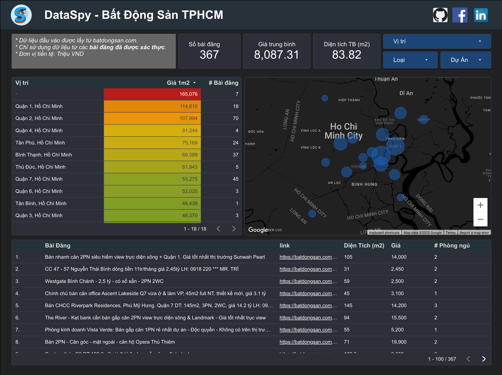

# Overview

This project uses Python for scraping real estate listings from from [batdongsan.com.vn](https://batdongsan.com.vn). The flow of the project:


* Scraping data from batdongsan.com
* Storing on Supabase
* Visualizing & analysing on [Google Locker Studio](https://lookerstudio.google.com/reporting/9e21618f-97dc-4480-b101-cbda26b9b2a5)
    

# Quick Start

## 1. Set Up a Python Environment

It is recommended to use a virtual environment:

```bash
python3 -m venv venv
source venv/bin/activate
```

## 2. Install Dependencies

```bash
pip install -r requirements.txt
```

## 3. Configure Environment Variables

Create a `.env` file in the project root with your Supabase credentials and any other required settings. Example:

```bash
SUPABASE_URL=your_supabase_url
SUPABASE_KEY=your_supabase_key
```

## 4. Run the Scraper

```bash
python main.py
```

# To do

## Getting the verified field

* find in "pr-title js__card-title" the "re__card-image-verified "
* pros: getting the fuller vision over the market -> avoid overlooking good deals
* cons: potential information contaminated because of scammed listings

Sample HTML:

```html
<span class="pr-title js__card-title" product-title="">
    <span class="re__card-image-verified " data-bds-tooltip-width="220" data-bds-tooltip-position="top" data-bds-tooltip="Tin đăng đã được xác thực thông qua việc kiểm tra sổ đỏ và hình ảnh cung cấp bởi người đăng tin. &lt;a style=&quot;display: flex; justify-content: center; text-align: center; text-decoration: underline; font-size: 13px&quot; class=&quot;js__verified-info-click&quot; href=&quot;javascript:void(0);&quot; onclick=&quot;window.FrontEnd_Product_VerifiedListing.ShowVerifiedListingPopup();&quot; tracking-id=&quot;verified-more-infor-click&quot; tracking-label=&quot;loc=text&quot;&gt; Tìm hiểu thêm&lt;/span&gt;"></span>
        Vinhome Ba Son 3 phòng ngủ đầu hồi giá tốt nhất định phải mua tháng 09 ( 240tr/m2 còn sót lại )
        </span>
```


