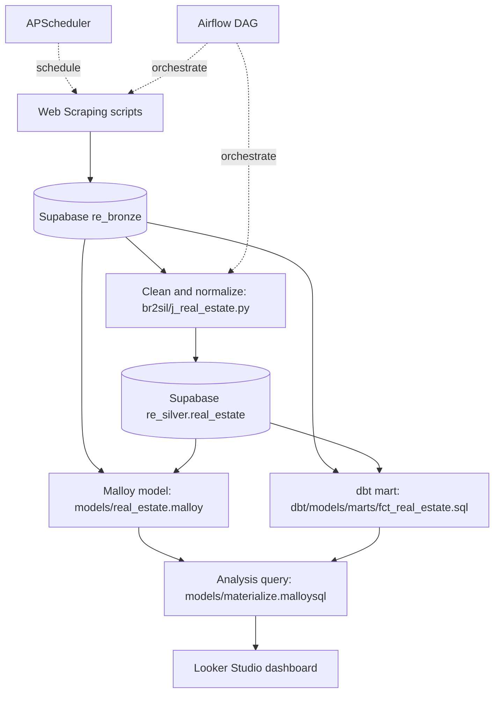

# Dữ liệu bất động sản

Dự án thu thập dữ liệu, chuẩn hóa dữ liệu để thực hiện phân tích về thị trường bất động sản tại Việt Nam với nguồn dữ liệu từ [batdongsan.com.vn](https://batdongsan.com.vn)

### Quy trình xử lý dữ liệu

### Dashboard minh họa

### Báo cáo mẫu: 
- [Báo cáo giá bất động sản theo dự án tại HN & TPHCM](reports/output/HCM-HN_prj.html)
- [Báo cáo giá bất động sản theo quận (cũ) tại HN & TPHCM](reports/output/HCM-HN_districts.html)

## Bắt đầu nhanh

- Quickstart: [docs/quickstart.md](docs/quickstart.md)
- Hướng dẫn kỹ thuật: [docs/technical-guides.md](docs/technical-guides.md)

```mermaid
graph TD
  A[Web Scraping scripts] --> B[(Supabase re_bronze)]
  B --> C[Clean and normalize: br2sil/j_real_estate.py]
  C --> D[(Supabase re_silver.real_estate)]

  B --> E[Malloy model: models/real_estate.malloy]
  D --> E
  B --> F[dbt mart: dbt/models/marts/fct_real_estate.sql]
  D --> F

  E --> G[Analysis query: models/materialize.malloysql]
  F --> G
  G --> H[Looker Studio dashboard]

  J[APScheduler] -. schedule .-> A
  K[Airflow DAG] -. orchestrate .-> A
  K -. orchestrate .-> C
```


