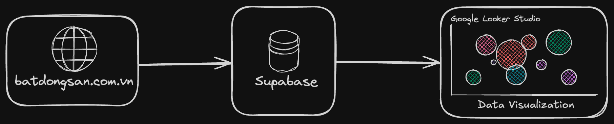

# Scrape Batdongsan Data

Du an open source ca nhan de thu thap, chuan hoa va phan tich du lieu bat dong san tu [batdongsan.com.vn](https://batdongsan.com.vn).

## Start Here

- Quickstart: [docs/quickstart.md](docs/quickstart.md)
- Docs Hub: [docs/README.md](docs/README.md)
- Technical Guides: [docs/technical-guides.md](docs/technical-guides.md)
- Reports folder: [reports/](reports/)
- Report HTML sample: [reports/output/malloy_result.html](reports/output/malloy_result.html)

## Overview

Du an xay dung data pipeline co the lap lai:

1. Scrape listings, projects, va location metadata.
2. Luu tru va xu ly du lieu tren Supabase/PostgreSQL.
3. Modeling phuc vu analytics bang Malloy + dbt.
4. Tao report va dashboard de phan tich thi truong.




```mermaid
subgraph B[Web Scraping Layer]
    B1[j_real_estate.py<br/>Listings crawler + tracking JSON merge]
    B2[j_projects.py<br/>Projects crawler]
    B3[j_metadata.py<br/>Cities, wards, streets, projects metadata APIs]
end

B --> C[(Supabase PostgreSQL<br/>re_bronze)]

C --> D[br2sil/j_real_estate.py<br/>Cleaning + normalization]
D --> E[(Supabase PostgreSQL<br/>re_silver.real_estate)]

E --> F[Malloy Semantic Model<br/>models/real_estate.malloy]
C --> F

C --> G[dbt Mart Model<br/>dbt/models/marts/fct_real_estate.sql]
E --> G

F --> H[Analytical Queries<br/>models/materialize.malloysql]
G --> H

H --> I[Looker Studio Dashboard]

J[APScheduler local jobs] -. schedules .-> B
K[Airflow DAG scaffold] -. orchestrates .-> B
K -. orchestrates .-> D
```

## Why This Project

- Bien du lieu marketplace phi cau truc thanh du lieu bang co the query.
- Giam cong quet thu cong nho tap trung listing + thong tin du an.
- Xu ly cac van de data quality de san sang cho phan tich.
- Cung cap semantic layer de tra loi nhanh cac cau hoi gia va cung-cau.

## Main Features

- Scraper batched/asynchronous co browser impersonation de tang ti le request thanh cong.
- Merge listing cards voi `window.pageTrackingData` theo `product_id`.
- Metadata ingestion cho cities/wards/streets/projects.
- Pipeline Bronze -> Silver:
  - Parse gia va dien tich ve so.
  - Normalize loai hinh bat dong san.
  - Tinh lai gia theo m2.
  - Kiem tra duplicate va bo sung ngay scrape.
- Semantic model bang Malloy va mart model bang dbt.
- Ho tro orchestration bang APScheduler va Airflow scaffold.

## Run Commands

```bash
pip install -r requirements.txt
python -m src.web2br.j_real_estate
python -m src.web2br.j_projects
python -m src.web2br.j_metadata
python -m src.br2sil.j_real_estate
python src/reports/generate_report.py
```

## Navigation

- Neu ban moi vao repo: bat dau tai [docs/quickstart.md](docs/quickstart.md).
- Neu ban muon dao sau ky thuat: xem [docs/technical-guides.md](docs/technical-guides.md).
- Neu ban muon xem ket qua phan tich nhanh: mo [reports/](reports/) va [reports/output/malloy_result.html](reports/output/malloy_result.html).

## Notes

- Airflow DAG hien co mot so script path legacy can doi lai theo cau truc repo hien tai.
- Khuyen nghi tach secrets/credentials ra bien moi truong thay vi luu cung code.


